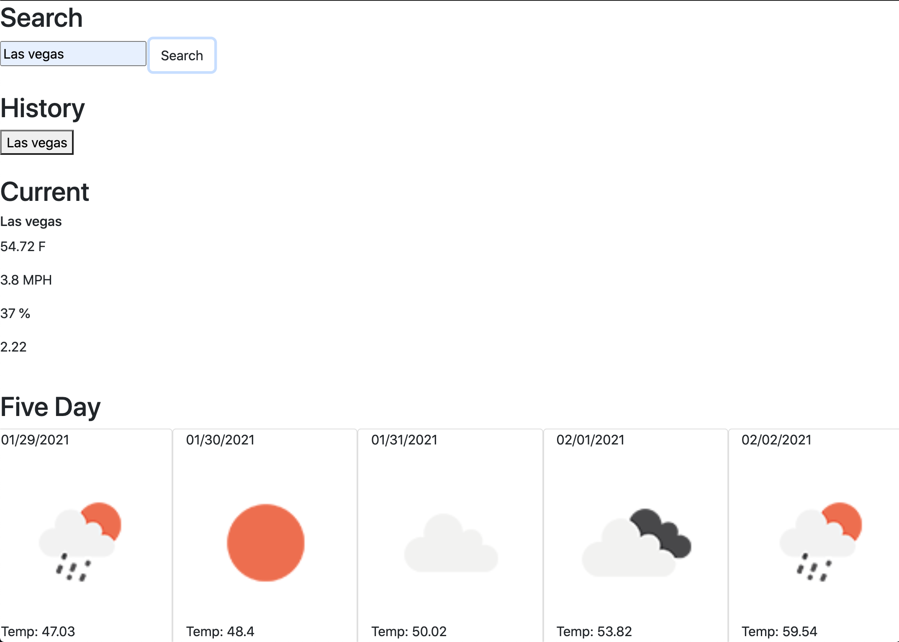

# Weather.Dashboard



# Basic Understanding HW:

We must retrieve data using APIs and use it within our own app. BY using the URL we can request info. We must build a weather dashboard that runs in the browser and has Html and CSS.

# Steps that will help:

1. Create Html skeleton with appropriate links; script.js, jQuery(bottom of body).

2. Add Bootstrap CDN and CSS Sheet in header.

3. Use Weather API to retrieve weather data for cities. Review "How to start".

4. Get URL and API key for js

5. Plan out Bootstrap templates and CSS(floats).

6. Use Local storage to store data.

## Acceptance Criteria

```
GIVEN a weather dashboard with form inputs
WHEN I search for a city
THEN I am presented with current and future conditions for that city and that city is added to the search history
WHEN I view current weather conditions for that city
THEN I am presented with the city name, the date, an icon representation of weather conditions, the temperature, the humidity, the wind speed, and the UV index
WHEN I view the UV index
THEN I am presented with a color that indicates whether the conditions are favorable, moderate, or severe
WHEN I view future weather conditions for that city
THEN I am presented with a 5-day forecast that displays the date, an icon representation of weather conditions, the temperature, and the humidity
WHEN I click on a city in the search history
THEN I am again presented with current and future conditions for that city
WHEN I open the weather dashboard
THEN I am presented with the last searched city forecast
```

# DUE

URL deployed app
URL Github repository


